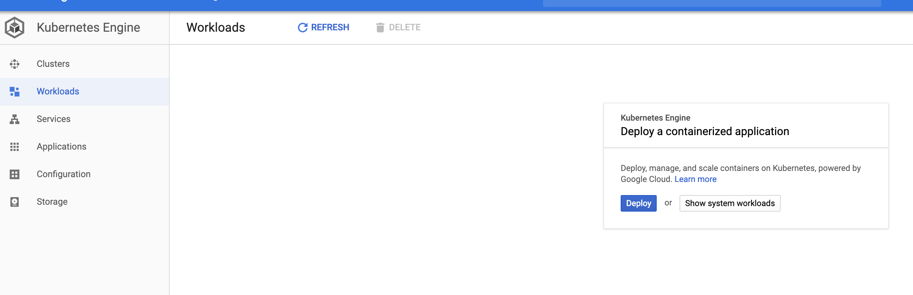

### Terraform project to demonstrate a gke/networking issue.

A private GKE cluster created using the following ip ranges, \
creates a non operational gke cluster due to some core services be unreachable.

##### Issues noticed
* In the google cloud web console, under kubernetes engine show system workloads.


* When a new gke cluster is using this set of ipranges. \
Specifically when the container range is `172.17.0.0/16` the `kube-dns` services goes into a crash loop, then causing other services to crash after.
```
# main.tf, module "vpc"
ip_cidr_range      = "172.31.0.0/23"
service_ip_range   = "172.31.4.0/23"
container_ip_range = "172.17.0.0/16"
```  


* Container logs for those crashing workloads indicate a network time out to/from the service ip range.


* The same module works fine when using a different set of iprages. 
```
# main.tf, module "vpc"
ip_cidr_range      = "172.31.0.0/23"
service_ip_range   = "172.31.4.0/23"
container_ip_range = "172.16.0.0/16"
```


##### How to use this repository
* Clone the repo and modify the local values in the main.tf
```hcl-terraform
locals {
  project = "< enter the gcp project name >"
  region  = "australia-southeast1"
  name    = "subnet-anomaly"
}
```

* Apply the configuration from the root folder.
```
terraform init
terraform plan
terraform apply
```

* Destroy
```
terraform destroy
```
